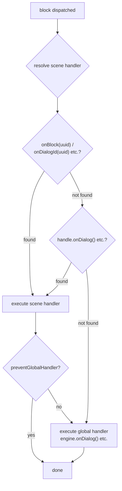

LSDE Dialog Engine — Full Guide [French] (plain text, auto-generated)
============================================================
Concatenates all guide sections for LLM consumption.
Source: lsde-ts/docs/fr/guide/*.md
============================================================

# C'est quoi LSDEDE?

**LSDE** (LS Dialog Editor) est un outil gratuit pour les développeurs de jeux et de logiciels qui combine l'édition visuelle de graphes de dialogue, la traduction assistée par IA, la génération de voix, l'intégration i18n au code, et les diagnostics de projet. Plus d'info : [lepasoft.com/fr/software/ls-dialog-editor](https://lepasoft.com/fr/software/ls-dialog-editor). LSDE exporte les graphes de dialogue en blueprints (JSON, XML, YAML ou CSV) contenant des scenes, blocks, connections, dictionaries et action signatures.

**LSDEDE** (LSDE Dialog Engine) est le engine multi-runtime qui load et exécute ces blueprints. Il est disponible en plusieurs langages pour une intégration native dans n'importe quel game engine ou framework.

## Runtimes disponibles

| Runtime | Langage | Cible | Source |
|---------|---------|-------|--------|
| **TypeScript** | TypeScript / JavaScript | Implémentation de référence | [lsde-ts](https://github.com/jonlepage/LS-Dialog-Editor-Engine/tree/master/lsde-ts) |
| **C#** | C# (.NET Standard 2.1) | Unity, Godot Mono, .NET | [lsde-csharp](https://github.com/jonlepage/LS-Dialog-Editor-Engine/tree/master/lsde-csharp) |
| **C++** | C++17 | Unreal Engine, engines custom | [lsde-cpp](https://github.com/jonlepage/LS-Dialog-Editor-Engine/tree/master/lsde-cpp) |
| **GDScript** | GDScript | Godot 4 | [lsde-gdscript](https://github.com/jonlepage/LS-Dialog-Editor-Engine/tree/master/lsde-gdscript) |

Tous les runtimes partagent le même format de blueprint et passent une suite de tests cross-language commune (42 cas de test).

## Architecture

Chaque runtime suit le même pattern de **callback-driven graph dispatcher** :

1. **Blueprint** — Un fichier exporté de LSDE (JSON, XML ou YAML), contenant les scenes, blocks et connections.
2. **Engine** — Valide le blueprint, build le graphe interne et dispatch les blocks aux handlers enregistrés.
3. **Handlers** — Les fonctions qui réagissent à chaque type de block (dialog, choice, condition, action).
4. **Le jeu** — Les conditions, actions et la résolution de personnages sont gérées par les handler callbacks.

```
      Blueprint
        │
        ▼
     Engine ◄── next() ──┐
        │                 │
     dispatch             │
        │                 │
        ▼                 │
     Handlers ────────────┘
```

## Principes de design

- **Zero-dependency** — Aucune dépendance runtime dans aucun langage.
- **Framework-agnostic** — Fonctionne avec n'importe quel game engine ou UI framework.
- **Callback-driven** — Pas de render loop interne. `next()` est appelé quand le code est prêt à continuer.
- **Two-tier handlers** — Handlers globaux (engine-level) et scene-level avec `preventGlobalHandler()`.
- **Conformité cross-language** — Tous les runtimes produisent un output identique pour le même blueprint.

================================================================================

# Pour commencer

## Installation

<!--@include: ../../_shared/install-tabs.md-->

## Usage minimal

Le engine est une machine de traversée de graphe — il dispatch les blocks aux handlers enregistrés qui leur donnent un sens. Sans handlers, le engine n'a aucun output.

> TIP:
Le engine consomme un objet `BlueprintExport`, pas un fichier. Vous pouvez charger votre blueprint depuis JSON, XML ou YAML avec n'importe quel parseur adapté à votre plateforme. Voir [Parsing & import](./parsing) pour les recommandations.

<!--@include: ../../_shared/getting-started-usage.md-->

## Validation du blueprint

`engine.init()` retourne un [rapport de diagnostic](/api-ref/interfaces/DiagnosticReport) avec erreurs, warnings et stats. L'option `check` permet de cross-valider avec les capabilities du jeu :

<!--@include: ../../_shared/getting-started-validation.md-->

================================================================================

# Blueprints & Scènes

## Structure du blueprint

Un `BlueprintExport` est le fichier JSON exporté de l'éditeur [LSDE](https://lepasoft.com/fr/software/ls-dialog-editor "Lepasoft Dialog Editor"). Il contient toutes les données dont le engine a besoin.

<!--@include: ../../_shared/blueprint-export-type.md-->

## Scenes

Une scene est une séquence de dialogue autonome — une conversation, une cinématique, un tutoriel, une interaction de shop. Dans un jeu, les scenes sont généralement déclenchées par des événements scriptés : le joueur parle à un NPC, entre dans une zone, ou ramasse un objet.

Chaque scene a son propre block d'entrée, son propre flow et son propre état. Plusieurs scenes peuvent tourner en parallèle (ex: un dialogue principal et un overlay de tutoriel). Les scenes sont définies par l'interface [`BlueprintScene`](/api-ref/interfaces/BlueprintScene) :

<!--@include: ../../_shared/blueprint-scene-type.md-->

## Connections

Les connections sont les fils entre les blocks — elles définissent quel block mène à quel autre. Dans l'éditeur, on les dessine visuellement; dans l'export, elles deviennent une liste plate de liens source → cible définis par l'interface [`BlueprintConnection`](/api-ref/interfaces/BlueprintConnection) :

<!--@include: ../../_shared/blueprint-connection-type.md-->

Vous n'aurez normalement pas besoin d'inspecter les connections directement — le engine gère le routing en interne. Elles sont toutefois accessibles via [`onValidateNextBlock`](/api-ref/classes/DialogueEngine#onvalidatenextblock) si nécessaire.

## Dictionaries

Les dictionaries décrivent les registres de votre jeu — switches, variables, inventaire. Le développeur les déclare dans [LSDE](https://lepasoft.com/fr/software/ls-dialog-editor "Lepasoft Dialog Editor") pour exposer au narrative designer les variables disponibles dans le moteur. Au runtime, le développeur mappe chaque dictionnaire vers le système correspondant de son jeu. Les [`conditions`](/api-ref/interfaces/ExportCondition) et [`onResolveCondition`](/api-ref/classes/DialogueEngine#onresolvecondition) utilisent ces clés pour évaluer l'état du jeu. Définis par [`Dictionary`](/api-ref/interfaces/Dictionary) :

<!--@include: ../../_shared/blueprint-dictionary-type.md-->

## Action Signatures

Les signatures décrivent les types d'actions disponibles dans votre jeu — `set_flag`, `play_sound`, `give_item`. Le développeur les déclare dans [LSDE](https://lepasoft.com/fr/software/ls-dialog-editor "Lepasoft Dialog Editor") pour que le narrative designer compose des séquences d'actions avec des paramètres typés. Au runtime, le `id` de la signature est ce que le développeur mappe vers ses propres systèmes. Définis par [`ActionSignature`](/api-ref/interfaces/ActionSignature) :

<!--@include: ../../_shared/blueprint-signature-type.md-->

================================================================================

# Types de blocks

Les blocks sont les briques d'une scène de dialogue — chaque nœud dans le graphe de l'éditeur est un block. Le engine route le flow de block en block et appelle le handler correspondant à chaque type.

Il existe 5 types : **Dialog**, **Choice**, **Condition**, **Action** et **Note**. Les quatre premiers sont des blocks de contenu avec un handler dédié (`onDialog`, `onChoice`, `onCondition`, `onAction`) — les quatre sont **required** et validés à l'appel de `start()`. Les blocks Note sont automatiquement ignorés.

Les handlers se déclinent en deux niveaux : les **global handlers** (enregistrés sur le engine) couvrent toutes les scènes et suffisent pour la plupart des jeux. Les **scene handlers** (enregistrés sur un [`SceneHandle`](/api-ref/interfaces/SceneHandle)) peuvent compléter ou remplacer les globaux pour une scène spécifique. Voir [Handlers](/fr/guide/handlers) pour le détail.

## DIALOG

Un block dialog représente une réplique — un personnage qui parle, un narrateur, un texte à l'écran. Le engine résout le personnage via le callback `onResolveCharacter` et l'expose dans `context.character`. Un handler dialog typique crée une instance de texte dans le jeu (textbox, bulle, sous-titre…), attend que le joueur ou une animation termine, puis appelle `next()` pour avancer le engine. La fonction de cleanup optionnelle permet de nettoyer les effets de bord quand le engine passe au bloc suivant.

<!--@include: ../../_shared/block-dialog.md-->

Quand le narrative designer assigne un output dédié par personnage ([`portPerCharacter`](/api-ref/interfaces/NativeProperties#portpercharacter)), le handler doit appeler `resolveCharacterPort()` pour indiquer au engine quel chemin suivre lors du `next()`.

## CHOICE

Un block choice représente un embranchement où le joueur choisit — un menu de réponses, des options de dialogue. Le `context.choices` contient toutes les options disponibles. Quand [`onResolveCondition()`](/fr/guide/choice-visibility) est configuré, chaque option est taggée `visible: true | false` — le handler filtre et affiche celles qu'il veut. Après l'interaction du joueur, `selectChoice(uuid)` indique au engine quel chemin suivre, puis `next()` avance le flow.

<!--@include: ../../_shared/block-choice.md-->

Voir [Choice Visibility](/fr/guide/choice-visibility) pour le système complet de tagging opt-in.

## CONDITION

Un block condition est un aiguillage invisible — il évalue l'état du jeu et envoie le flow sur l'un de deux chemins sans que le joueur le voie. Le handler évalue les conditions du block (variables, flags, inventaire…) puis appelle `context.resolve(result)` — `true` suit le port 0, `false` suit le port 1. Les conditions dont la clé commence par `choice:` référencent un choix précédent du joueur — `scene.evaluateCondition(cond)` les résout automatiquement via l'historique interne.

Le block condition supporte deux modes d'évaluation :

- **Mode switch** (par défaut) : les groupes de conditions sont évalués en séquence. Le premier groupe qui match route le flow vers son port (`true`/`case_N`). Si aucun ne match, le flow suit le port `false`/`default`. C'est un `switch/case` avec break implicite.

- **Mode dispatcher** ([`enableDispatcher`](/api-ref/interfaces/NativeProperties#enabledispatcher) `= true`) : **tous** les groupes qui matchent déclenchent leur port simultanément en tant que tracks async. Le port `false`/`default` devient la track principale de continuation ("Continue") et est **toujours exécuté**, qu'il y ait des matchs ou non. Les blocks connectés aux ports de condition **doivent** être async. C'est un pattern "fire & dispatch" — idéal pour déclencher des réactions parallèles (multi-NPC, événements simultanés) sans bloquer le flow principal.

<!--@include: ../../_shared/block-condition.md-->

## ACTION

Un block action déclenche des effets de bord dans le jeu — donner un item, jouer un son, activer un flag. Chaque action référence un `actionId` que le développeur mappe vers ses propres systèmes. Le handler exécute la liste d'actions puis appelle `context.resolve()` pour suivre le port "then", ou `context.reject(error)` pour suivre le port "catch" (fallback sur "then" si aucun "catch" n'existe).

<!--@include: ../../_shared/block-action.md-->

## NOTE

Un block note est un pense-bête pour le narrative designer — commentaires, rappels, contexte. Il est automatiquement ignoré pendant la traversée. Il est techniquement possible d'intercepter un block note via [`onBeforeBlock`](/fr/guide/lifecycle), mais c'est déconseillé — le block action devrait couvrir tous vos besoins en effets de bord.

## Propriétés communes

Tous les blocks partagent ces champs de base ([`BlueprintBlockBase`](/api-ref/interfaces/BlueprintBlockBase)) :

| Champ | Type | Description |
|-------|------|-------------|
| [`uuid`](/api-ref/interfaces/BlueprintBlockBase#uuid) | `string` | Identifiant unique |
| [`type`](/api-ref/interfaces/BlueprintBlockBase#type) | `BlockType` | Type discriminant |
| [`label`](/api-ref/interfaces/BlueprintBlockBase#label) | `string?` | Nom lisible par un humain |
| [`parentLabels`](/api-ref/interfaces/BlueprintBlockBase#parentlabels) | `string[]?` | Hiérarchie des dossiers parents dans l'éditeur |
| [`properties`](/api-ref/interfaces/BlueprintBlockBase#properties) | `BlockProperty[]` | Propriétés clé-valeur |
| [`userProperties`](/api-ref/interfaces/BlueprintBlockBase#userproperties) | `Record?` | Propriétés utilisateur libres |
| [`nativeProperties`](/api-ref/interfaces/BlueprintBlockBase#nativeproperties) | `NativeProperties?` | Propriétés d'exécution |
| [`metadata`](/api-ref/interfaces/BlueprintBlockBase#metadata) | `BlockMetadata?` | Metadata d'affichage (personnages, tags, couleur) |
| [`isStartBlock`](/api-ref/interfaces/BlueprintBlockBase#isstartblock) | `boolean?` | Marque le block d'entrée |

### NativeProperties

| Champ | Type | Description |
|-------|------|-------------|
| [`isAsync`](/api-ref/interfaces/NativeProperties#isasync) | `boolean?` | Exécuter sur un track async parallèle |
| [`delay`](/api-ref/interfaces/NativeProperties#delay) | `number?` | Délai avant exécution (consommé par `onBeforeBlock`) |
| [`timeout`](/api-ref/interfaces/NativeProperties#timeout) | `number?` | Timeout d'exécution |
| [`portPerCharacter`](/api-ref/interfaces/NativeProperties#portpercharacter) | `boolean?` | Un output port par personnage dans les metadata |
| [`skipIfMissingActor`](/api-ref/interfaces/NativeProperties#skipifmissingactor) | `boolean?` | Ignorer le block si l'acteur est absent |
| [`debug`](/api-ref/interfaces/NativeProperties#debug) | `boolean?` | Flag de debug pour l'éditeur |
| [`waitForBlocks`](/api-ref/interfaces/NativeProperties#waitforblocks) | `string[]?` | UUIDs de blocks qui doivent être visités avant que ce block puisse progresser |
| [`waitInput`](/api-ref/interfaces/NativeProperties#waitinput) | `boolean?` | Flag passif pour contrôle d'input joueur explicite |
| [`enableDispatcher`](/api-ref/interfaces/NativeProperties#enabledispatcher) | `boolean?` | Mode dispatcher : toutes les conditions valides déclenchent leur port async, le port false/default devient la track de continuation |

================================================================================

# Visibilité des choix

## Aperçu

Quand un block CHOICE est dispatché, `context.choices` contient toujours **tous** les choix définis dans le blueprint — rien n'est pré-filtré. Le engine n'enlève jamais de choix du array.

Pour du filtrage de visibilité (ex. cacher des choix basés sur le game state ou des sélections précédentes), le engine fournit un système de **tagging opt-in**. Un condition resolver est installé une seule fois, et le engine tag chaque choix avec `visible: true | false` avant que le handler `onChoice` le reçoive.

## Setup

Enregistrez un condition resolver sur le engine — une seule fois, avant de démarrer une scène :

<!--@include: ../../_shared/choice-filter-setup.md-->

Quand le resolver est installé, le engine évalue les `visibilityConditions` de chaque choix **avant** d'appeler `onChoice`. Le même resolver pré-évalue aussi les groupes de condition blocks -- voir [Condition blocks](/fr/guide/block-types#condition) pour les détails.

- **Conditions `choice:`** (qui référencent des sélections précédentes du joueur) sont résolues automatiquement par le engine via son historique de choix interne — le callback ne les reçoit jamais.
- **Conditions de game-state** (tout le reste) sont déléguées au callback.
- Le chaining avec `&` (AND) et `|` (OR) fonctionne correctement entre les deux types.

## Filtrage dans onChoice

Dans le handler, le filtrage se fait avec une seule ligne :

<!--@include: ../../_shared/choice-visibility-handler.md-->

### Pourquoi `visible !== false` et pas `=== true`?

Quand **aucun resolver n'est installé**, `visible` est `undefined`. Comme `undefined !== false` donne `true`, tous les choix passent — rétrocompatible par défaut. Quand un resolver **est installé**, les choix sont taggés `true` ou `false` explicitement.

| Valeur de `visible` | Signification | `!== false` |
|---|---|---|
| `true` | Resolver installé, le choix passe | `true` |
| `false` | Resolver installé, choix caché | `false` |
| `undefined` | Pas de resolver installé | `true` |

## RuntimeChoiceItem

Quand un resolver est installé, chaque choix dans `context.choices` est un `RuntimeChoiceItem` — une extension de `ChoiceItem` avec le tag `visible` :


```ts [TypeScript]
interface RuntimeChoiceItem extends ChoiceItem {
  visible?: boolean; // true | false | undefined
}
```
```csharp [C#]
public class RuntimeChoiceItem : ChoiceItem
{
    public bool? Visible { get; set; } // true | false | null
}
```
```cpp [C++]
struct RuntimeChoiceItem : ChoiceItem {
    std::optional<bool> visible; // true | false | nullopt
};
```
```gdscript [GDScript]
# RuntimeChoiceItem is a Dictionary with an extra "visible" key:
# { "uuid": "...", "dialogueText": {...}, "visible": true/false/absent }
```

Sans resolver, les choix sont toujours des `RuntimeChoiceItem` mais `visible` reste `undefined`/`null`/`nullopt`/absent.

## Exemples

### Standard — afficher les choix visibles


```ts [TypeScript]
engine.onChoice(({ context, next }) => {
  const visible = context.choices.filter(c => c.visible !== false);
  ui.showChoices(visible, (uuid) => {
    context.selectChoice(uuid);
    next();
  });
});
```
```csharp [C#]
engine.OnChoice(args => {
    var visible = args.Context.Choices
        .Where(c => c.Visible != false).ToList();
    ShowChoicesUI(visible, uuid => {
        args.Context.SelectChoice(uuid);
        args.Next();
    });
    return null;
});
```
```cpp [C++]
engine.onChoice([](auto*, auto*, auto* ctx, auto next) -> CleanupFn {
    std::vector<const RuntimeChoiceItem*> visible;
    for (const auto& c : ctx->choices())
        if (!c.visible.has_value() || c.visible.value())
            visible.push_back(&c);
    showChoicesUI(visible, [ctx, next](const auto& uuid) {
        ctx->selectChoice(uuid);
        next();
    });
    return {};
});
```
```gdscript [GDScript]
engine.on_choice(func(args):
    var visible = []
    for c in args["context"].choices:
        if c.get("visible") != false:
            visible.append(c)
    show_choices_ui(visible, func(uuid):
        args["context"].select_choice(uuid)
        args["next"].call()
    )
    return Callable()
)
```

### Choix minuté — auto-select au timeout


```ts [TypeScript]
engine.onChoice(({ block, context, next }) => {
  const visible = context.choices.filter(c => c.visible !== false);
  const timeout = block.nativeProperties?.timeout;

  const resolve = (choice) => {
    context.selectChoice(choice.uuid);
    next();
  };

  if (timeout) {
    const timer = setTimeout(() => resolve(visible[0]), timeout * 1000);
    ui.showChoices(visible, (uuid) => {
      clearTimeout(timer);
      resolve(visible.find(c => c.uuid === uuid));
    });
  } else {
    ui.showChoices(visible, (uuid) => resolve(visible.find(c => c.uuid === uuid)));
  }
});
```
```csharp [C#]
engine.OnChoice(args => {
    var (_, block, context, next) = args;
    var visible = context.Choices
        .Where(c => c.Visible != false).ToList();
    var timeout = block.NativeProperties?.Timeout;

    void Resolve(RuntimeChoiceItem choice) {
        context.SelectChoice(choice.Uuid);
        next();
    }

    if (timeout.HasValue)
    {
        // use your engine's timer — cancel on player selection
        var timer = ScheduleTimer((float)timeout.Value, () => Resolve(visible[0]));
        ShowChoicesUI(visible, uuid => {
            timer.Cancel();
            Resolve(visible.First(c => c.Uuid == uuid));
        });
    }
    else
    {
        ShowChoicesUI(visible, uuid => Resolve(visible.First(c => c.Uuid == uuid)));
    }
    return null;
});
```
```cpp [C++]
engine.onChoice([](auto*, auto* block, auto* ctx, auto next) -> CleanupFn {
    std::vector<const RuntimeChoiceItem*> visible;
    for (const auto& c : ctx->choices())
        if (!c.visible.has_value() || c.visible.value())
            visible.push_back(&c);

    auto timeout = block->nativeProperties
        ? block->nativeProperties->timeout : std::nullopt;

    auto resolve = [ctx, next](const std::string& uuid) {
        ctx->selectChoice(uuid);
        next();
    };

    if (timeout.has_value()) {
        // use your engine's timer — cancel on player selection
        auto timer = scheduleDelay(timeout.value(), [&]() { resolve(visible[0]->uuid); });
        showChoicesUI(visible, [resolve, timer](const auto& uuid) {
            timer->cancel();
            resolve(uuid);
        });
    } else {
        showChoicesUI(visible, resolve);
    }
    return {};
});
```
```gdscript [GDScript]
engine.on_choice(func(args):
    var ctx = args["context"]
    var next_fn = args["next"]
    var block = args["block"]
    var visible = []
    for c in ctx.choices:
        if c.get("visible") != false:
            visible.append(c)

    var timeout_val = block.get("nativeProperties", {}).get("timeout", 0)

    if timeout_val > 0:
        # use your engine's timer — cancel on player selection
        var timer = get_tree().create_timer(timeout_val)
        timer.timeout.connect(func():
            ctx.select_choice(visible[0]["uuid"])
            next_fn.call()
        )
        show_choices_ui(visible, func(uuid):
            timer.time_left = 0  # cancel
            ctx.select_choice(uuid)
            next_fn.call()
        )
    else:
        show_choices_ui(visible, func(uuid):
            ctx.select_choice(uuid)
            next_fn.call()
        )
    return Callable()
)
```

### Choix cachés affichés en grisé


```ts [TypeScript]
engine.onChoice(({ context, next }) => {
  for (const choice of context.choices) {
    if (choice.visible === false) {
      ui.addGreyed(choice);   // show but disabled
    } else {
      ui.addNormal(choice);   // selectable
    }
  }
  // wait for player selection...
});
```
```csharp [C#]
engine.OnChoice(args => {
    foreach (var choice in args.Context.Choices)
    {
        if (choice.Visible == false)
            AddGreyed(choice);   // show but disabled
        else
            AddNormal(choice);   // selectable
    }
    // wait for player selection...
    return null;
});
```
```cpp [C++]
engine.onChoice([](auto*, auto*, auto* ctx, auto next) -> CleanupFn {
    for (const auto& choice : ctx->choices()) {
        if (choice.visible.has_value() && !choice.visible.value())
            addGreyed(choice);   // show but disabled
        else
            addNormal(choice);   // selectable
    }
    // wait for player selection...
    return {};
});
```
```gdscript [GDScript]
engine.on_choice(func(args):
    for choice in args["context"].choices:
        if choice.get("visible") == false:
            add_greyed(choice)   # show but disabled
        else:
            add_normal(choice)   # selectable
    # wait for player selection...
    return Callable()
)
```

### Tutorial — ignorer complètement la visibilité


```ts [TypeScript]
tutorial.onChoice(({ context, next }) => {
  // force-select the first choice, no filtering
  context.selectChoice(context.choices[0].uuid);
  next();
});
```
```csharp [C#]
tutorial.OnChoice(args => {
    // force-select the first choice, no filtering
    args.Context.SelectChoice(args.Context.Choices[0].Uuid);
    args.Next();
    return null;
});
```
```cpp [C++]
tutorial->onChoice([](auto*, auto*, auto* ctx, auto next) -> CleanupFn {
    // force-select the first choice, no filtering
    ctx->selectChoice(ctx->choices()[0].uuid);
    next();
    return {};
});
```
```gdscript [GDScript]
tutorial.on_choice(func(args):
    # force-select the first choice, no filtering
    args["context"].select_choice(args["context"].choices[0]["uuid"])
    args["next"].call()
    return Callable()
)
```

## Partager l'évaluateur

Avec `onResolveCondition`, un seul callback gère **à la fois** la visibilité des choix et la pré-évaluation des condition blocks. Plus besoin de dupliquer la logique :

<!--@include: ../../_shared/choice-reusable-filter.md-->

> TIP:
Avant `onResolveCondition`, la même logique `gameState.check(...)` devait être enregistrée séparément dans `setChoiceFilter` et `onCondition`. Avec le resolver unifié, c'est un seul callback — le engine gère les deux automatiquement.

## Avancé : Filtrage manuel

Si un resolver global n'est pas souhaité, `LsdeUtils` fournit un utilitaire low-level :


```ts [TypeScript]
import { LsdeUtils } from '@lsde/dialog-engine';

const visible = LsdeUtils.filterVisibleChoices(
  block.choices ?? [],
  (cond) => gameState.check(cond.key, cond.operator, cond.value),
  scene, // optional — enables choice: condition resolution via history
);
```
```csharp [C#]
var visible = LsdeUtils.FilterVisibleChoices(
    block.Choices ?? new(),
    cond => GameState.Check(cond.Key, cond.Operator, cond.Value),
    scene // optional — enables choice: condition resolution via history
);
```
```cpp [C++]
auto visible = lsde::LsdeUtils::FilterVisibleChoices(
    block->choices,
    [](const auto& cond) { return gameState.check(cond.key, cond.op, cond.value); },
    scene // optional — enables choice: condition resolution via history
);
```
```gdscript [GDScript]
var visible = LsdeUtils.filter_visible_choices(
    block.get("choices", []),
    func(cond): return game_state.check(cond),
    scene # optional — enables choice: condition resolution via history
)
```

Le paramètre `scene` active la résolution automatique des conditions `choice:`. Sans celui-ci, toutes les conditions sont déléguées au evaluator callback.

================================================================================

# Handlers

## Handlers

Les handlers sont le pont entre le engine et votre jeu. Ils fonctionnent comme des observateurs — vous abonnez une fonction, et le engine l'exécute quand l'événement correspondant se produit. C'est à travers eux que vous déclenchez les bons comportements dans votre moteur : afficher du texte, jouer une animation, évaluer un état, etc.

Le engine expose les handlers suivants :

| Handler | Niveau | Description |
|---------|--------|-------------|
| [`onDialog`](/api-ref/classes/DialogueEngine#ondialog) | global / scene | Block dialog — afficher du texte |
| [`onChoice`](/api-ref/classes/DialogueEngine#onchoice) | global / scene | Block choice — présenter des choix |
| [`onCondition`](/api-ref/classes/DialogueEngine#oncondition) | global / scene | Block condition — évaluer et brancher |
| [`onAction`](/api-ref/classes/DialogueEngine#onaction) | global / scene | Block action — déclencher des effets |
| [`onResolveCharacter`](/api-ref/classes/DialogueEngine#onresolvecharacter) | global / scene | Résoudre quel personnage parle |
| [`onBeforeBlock`](/api-ref/classes/DialogueEngine#onbeforeblock) | global | Avant chaque block (delay, animations d'entrée…) |
| [`onValidateNextBlock`](/api-ref/classes/DialogueEngine#onvalidatenextblock) | global | Valider avant de progresser vers un block |
| [`onInvalidateBlock`](/api-ref/classes/DialogueEngine#oninvalidateblock) | global | Réagir quand la validation échoue |
| [`onSceneEnter`](/api-ref/classes/DialogueEngine#onsceneenter) | global / scene | Une scène démarre |
| [`onSceneExit`](/api-ref/classes/DialogueEngine#onsceneexit) | global / scene | Une scène se termine |
| [`onBlock`](/api-ref/interfaces/SceneHandle#onblock) | scene | Override un block spécifique par UUID |
| [`onDialogId`](/api-ref/interfaces/SceneHandle#ondialogid) | scene | Override un block DIALOG spécifique par UUID (type-safe) |
| [`onChoiceId`](/api-ref/interfaces/SceneHandle#onchoiceid) | scene | Override un block CHOICE spécifique par UUID (type-safe) |
| [`onConditionId`](/api-ref/interfaces/SceneHandle#onconditionid) | scene | Override un block CONDITION spécifique par UUID (type-safe) |
| [`onActionId`](/api-ref/interfaces/SceneHandle#onactionid) | scene | Override un block ACTION spécifique par UUID (type-safe) |
| [`onResolveCondition`](/api-ref/classes/DialogueEngine#onresolvecondition) | global | Résolveur unifié de conditions (visibilité des choix + pré-évaluation des conditions) |
| ~~[`setChoiceFilter`](/api-ref/classes/DialogueEngine#setchoicefilter)~~ | global | _Déprécié — utilisez `onResolveCondition` à la place_ |

`onDialog`, `onChoice` et `onAction` sont **required** — le engine valide leur présence à l'appel de `start()` et throw une erreur descriptive si un manque. `onCondition` est **optionnel** quand `onResolveCondition` est installé — le engine auto-route depuis les groupes de conditions pré-évalués.

<!--@include: ../../_shared/handler-basic.md-->

## Two-Tier Handler System

Le engine résout les handlers sur deux niveaux :

- **Global handlers** — enregistrés sur le engine, ils définissent le comportement par défaut de chaque scène. Ils suffisent dans la majorité des cas.
- **Scene handlers** — enregistrés sur un [`SceneHandle`](/api-ref/interfaces/SceneHandle) spécifique, ils permettent de court-circuiter ou d'étendre le comportement par défaut quand une scène nécessite un rendu ou un contrôle différent. C'est rare, mais disponible.

Quand un block est dispatché, le engine résout le handler dans cet ordre :
1. `handle.onBlock(uuid)` ou `handle.onDialogId(uuid)` / `handle.onActionId(uuid)` / ... — override spécifique à un block
2. `handle.onDialog()` / `handle.onChoice()` / ... — handler de type au niveau scène
3. `engine.onDialog()` / `engine.onChoice()` / ... — handler global

Quand les deux niveaux sont présents, les deux s'exécutent en séquence — scène d'abord, puis global — sauf si le scene handler appelle `context.preventGlobalHandler()` pour supprimer le passage global.

<!--@include: ../../_shared/handler-tier1.md-->

## Character Resolution

Le système de résolution de personnage est optionnel. En enregistrant un callback `onResolveCharacter`, le engine l'invoque avant chaque block qui contient des personnages dans ses `metadata.characters`. Le callback reçoit la liste des personnages assignés au block et retourne celui qui doit être actif — ou `undefined` si aucun n'est disponible. Le personnage résolu est ensuite accessible via `context.character` dans tous les handlers.

C'est le point d'intégration idéal pour interroger l'état de votre jeu : vérifier si un personnage est présent dans la scène, en vie, dans le champ de la caméra, etc. Retourner `undefined` ouvre la porte à plusieurs stratégies : sauter le block via [`skipIfMissingActor`](/api-ref/interfaces/NativeProperties#skipifmissingactor), annuler la scène via `handle.cancel()`, ou gérer le cas directement dans le handler.

<!--@include: ../../_shared/handler-character.md-->

## Scene Lifecycle

Les callbacks `onSceneEnter` et `onSceneExit` permettent de réagir au démarrage et à la fin d'une scène — activer un mode cinématique, arrêter les NPC, préparer l'UI, nettoyer les ressources, etc. Ils sont disponibles au niveau global (sur le engine) et au niveau scène (via `handle.onEnter()` / `handle.onExit()`). Le scene handler remplace le global s'il est défini.

<!--@include: ../../_shared/handler-lifecycle.md-->

## Block Override

`onBlock(uuid)` permet de cibler un block précis par son identifiant pour lui attribuer un handler dédié. C'est un cas d'usage rare — les handlers génériques couvrent la grande majorité des besoins — mais pour des scénarios très spécifiques où un block individuel nécessite un comportement distinct, c'est disponible.

<!--@include: ../../_shared/handler-block-override.md-->

## Type-Safe Block Override

`onDialogId(uuid)`, `onChoiceId(uuid)`, `onConditionId(uuid)` et `onActionId(uuid)` sont des alternatives type-safe à `onBlock(uuid)`. Ils fonctionnent exactement de la même façon — même priorité, même support de `preventGlobalHandler` — mais le handler reçoit le type de block spécialisé et le contexte au lieu de l'union générique.

Utilisez-les quand vous connaissez le type du block au moment de l'enregistrement et que vous voulez l'autocomplétion complète sur `block` et `context`.

<!--@include: ../../_shared/handler-block-override-typed.md-->

## Visual Reference

### Two-Tier Handler Dispatch



================================================================================

# Intégration moteur

LSDE est agnostique — aucune dépendance sur un moteur de jeu, un framework UI ou un système audio. Il traverse un graphe et appelle vos handlers. Cette page montre comment le brancher dans les moteurs les plus courants.

Pour l'implémentation détaillée de chaque type de handler, voir [Types de blocks](./block-types) et [Handlers](./handlers).

## Intégration complète

L'exemple suivant montre une façon d'intégrer LSDE dans chaque moteur. Il couvre les 4 handlers requis — dialog, choice, condition, action — dans une seule classe, comme point de départ.

Chaque jeu a ses propres besoins. Adaptez la structure, le découpage et l'UI à votre projet.

<!--@include: ../../_shared/integration-complete.md-->

## Les 4 handlers

Chaque handler reçoit les données du block et un callback `next()`. C'est au développeur de traiter ces données dans son moteur, puis d'appeler `next()` quand le block est terminé. Le moment de cet appel appartient entièrement au jeu.

- **Dialog** — texte, personnage, propriétés natives. Affichez le dialogue dans votre UI, attendez l'input joueur ou un délai, puis appelez `next()`. Retournez une fonction de cleanup pour masquer l'UI quand le engine passe au block suivant.

- **Choice** — liste de choix tagués `visible` si un `choiceFilter` est configuré. Créez les éléments UI correspondants — boutons, liste, radial menu. Au choix du joueur, `selectChoice(uuid)` indique la branche à suivre, puis `next()` avance le flow.

- **Condition** — conditions définies dans le block. Évaluez-les avec la logique de votre jeu — flags, quêtes, inventaire. `context.resolve(true)` envoie le flow vers le port 0, `context.resolve(false)` vers le port 1.

- **Action** — actions définies dans le block. Exécutez-les dans votre moteur — jouer un son, donner un item, déclencher une cinématique. `context.resolve()` confirme le succès, `context.reject(err)` signale un échec.

## Tips

- **`next()` est la télécommande.** L'appeler instantanément pour du dialogue rapide, ou le garder en réserve jusqu'à ce qu'une animation finisse. Le engine attend — il n'a aucun concept du temps.
- **Les fonctions de cleanup nettoient derrière vous.** Retournez une fonction depuis n'importe quel handler — le engine l'appelle quand il passe au block suivant. Idéal pour masquer l'UI, stopper l'audio ou libérer des nodes.
- **`onBeforeBlock` gère les delays.** Le engine n'impose pas `nativeProperties.delay` — c'est `onBeforeBlock` qui le lit et appelle `resolve()` après un timer. Contrôle total.
- **Les tracks async sont des flux parallèles.** Quand une cutscene a besoin de dialogue et de mouvement de caméra en simultané, les blocks marqués `isAsync` dans l'éditeur s'exécutent sur des tracks indépendantes.

================================================================================
