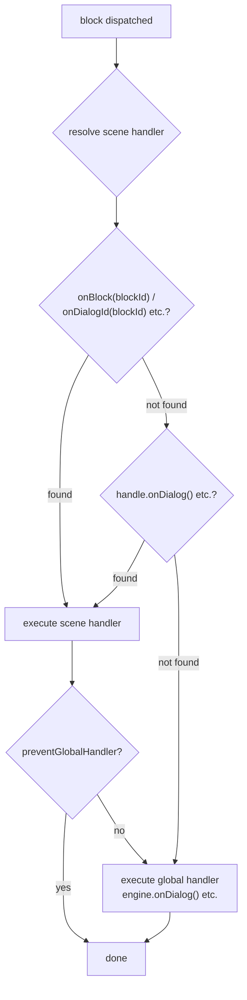

LSDE Dialog Engine — Full Guide [English] (plain text, auto-generated)
============================================================
Concatenates all guide sections for LLM consumption.
Source: lsde-ts/docs/guide/*.md
============================================================

# What is LSDEDE?

**LSDE** (LS Dialog Editor) is a free tool for game and software developers that combines visual dialogue graph editing, AI-powered translation, voice generation, i18n code integration, and project diagnostics. It exports dialogue graphs as blueprints (JSON, XML, YAML, or CSV) containing scenes, blocks, dictionaries, functions and cards. More info: [lepasoft.com/en/software/ls-dialog-editor](https://lepasoft.com/en/software/ls-dialog-editor).

**LSDEDE** (LSDE Dialog Engine) is the multi-runtime engine that loads and executes these blueprints. It is available in multiple languages for native integration into any game engine or framework.

## Available Runtimes

| Runtime | Language | Target | Source |
|---------|----------|--------|--------|
| **TypeScript** | TypeScript / JavaScript | Reference implementation | [lsde-ts](https://github.com/jonlepage/LS-Dialog-Editor-Engine/tree/master/lsde-ts) |
| **C#** | C# (.NET Standard 2.1) | Unity, Godot Mono, .NET | [lsde-csharp](https://github.com/jonlepage/LS-Dialog-Editor-Engine/tree/master/lsde-csharp) |
| **C++** | C++17 | Unreal Engine, custom engines | [lsde-cpp](https://github.com/jonlepage/LS-Dialog-Editor-Engine/tree/master/lsde-cpp) |
| **GDScript** | GDScript | Godot 4 | [lsde-gdscript](https://github.com/jonlepage/LS-Dialog-Editor-Engine/tree/master/lsde-gdscript) |

All runtimes share the same blueprint format and pass a common cross-language test suite (52 test cases).

## Architecture

Every runtime follows the same **callback-driven graph dispatcher** pattern:

1. **Blueprint** — An export from LSDE (JSON, XML, YAML or CSV). Every block carries its own outgoing wires in `next`: there is no connection table.
2. **Engine** — Validates the blueprint, builds the internal graph and dispatches blocks to registered handlers.
3. **Handlers** — Functions that react to each block type (dialog, choice, condition, action).
4. **Host Application** — Conditions, actions, and character resolution are implemented by handler callbacks.

```
      Blueprint
        │
        ▼
     Engine ◄── next() ──┐
        │                 │
     dispatch             │
        │                 │
        ▼                 │
     Handlers ────────────┘
```

## Design Principles

- **Zero-dependency** — No runtime dependencies in any language.
- **Framework-agnostic** — Works with any game engine or UI framework.
- **Callback-driven** — No internal render loop. The host application calls `next()` when ready.
- **Two-tier handlers** — Global (engine-level) and scene-level handlers with `preventGlobalHandler()`.
- **Cross-language conformance** — All runtimes produce identical output for the same blueprint.

================================================================================

# Getting Started

## Installation

<!--@include: ../_shared/install-tabs.md-->

## Minimal Usage

The engine is a graph traversal machine — it dispatches blocks to registered handlers, which give them meaning. Without handlers, the engine has no output.

> TIP:
The engine consumes a `BlueprintExport` object, not a file. You can load your blueprint from JSON, XML, or YAML using any parser suited to your platform. See [Parsing & Import](./parsing) for recommendations.

<!--@include: ../_shared/getting-started-usage.md-->

## Blueprint Validation

`engine.init()` returns a [diagnostic report](/api-ref/interfaces/DiagnosticReport) with errors, warnings, and stats. The `check` option cross-validates against the host application's capabilities:

<!--@include: ../_shared/getting-started-validation.md-->

### The seventeen diagnostics

**Errors — the payload is refused and nothing plays.** `errors` is non-empty and `engine.scene()` has nothing to hand you.

| Code | What happened |
|---|---|
| `MISSING_DATA` | No `data` was passed to `init()` |
| `MISMATCHED_EXPORTS` | Several files merged that come from different exports — `project` or `exportedAt` disagree. Pass the files of ONE export |
| `WRONG_NAMING_CONVENTION` | Exported in `snake_case` or `PascalCase`; the engine reads camelCase. Project settings › Exporters › Naming convention |
| `INVALID_FORMAT` | `format` is not `lsde-blueprints`. It is also what C# and C++ report for the case above: they validate a typed object, so the original key names are already gone |
| `UNSUPPORTED_FORMAT_VERSION` | `version` is not `1`. A project still on LSDE 1.6 belongs on engine 0.3.x — there is no dual reader |
| `NO_SCENES` | The payload carries no scene |
| `DUPLICATE_SCENE` | Two scenes share a path or a stable id |
| `MISSING_SCENE_PATH` | A scene has no path |
| `DUPLICATE_BLOCK_ID` | Two blocks of the SAME scene share an id. Across scenes it is legal and expected — a block is (scene, id) |
| `INVALID_START_BLOCK` | The scene names a start block that is not one of its blocks |
| `BROKEN_LINK` | A wire points at a block that is not in the scene. The traversal would simply have nowhere to go |

**Warnings — it plays, and something will quietly not work.** Read them; none of them is noise.

| Code | What it costs you |
|---|---|
| `NO_START_BLOCK` | The scene has no start block, so `start()` has nowhere to begin |
| `UNKNOWN_WAIT_BLOCK` | A `waitForBlocks` id is not a block of the scene, so that track parks **for good**. The check cannot go further: an id that does exist may still never be played |
| `UNKNOWN_FUNCTION` | An action calls a function id your `check.functions` does not list |
| `UNKNOWN_DICTIONARY` | A condition tests a dictionary id your `check.dictionaries` does not list |
| `UNKNOWN_DICTIONARY_ENTRY` | The dictionary is known, the entry key is not |
| `UNKNOWN_CARD` | A block cites an actor card NAME your `check.cards` does not list |

The last four only appear when you pass `check` — without it the engine has nothing to compare against.

================================================================================

# Blueprints & Scenes

## Blueprint Structure

A `BlueprintExport` is the JSON file exported from the [LSDE](https://lepasoft.com/en/software/ls-dialog-editor "Lepasoft Dialog Editor") editor. It contains all the data the engine needs.

<!--@include: ../_shared/blueprint-export-type.md-->

## Scenes

A scene is a self-contained dialogue sequence — a conversation, a cutscene, a tutorial prompt, a shop interaction. In a game, scenes are typically triggered by script events: the player talks to an NPC, enters a zone, or picks up an item.

Each scene has its own entry block, its own flow, and its own state. Multiple scenes can run in parallel (e.g. a main dialogue and a tutorial overlay). Scenes are defined by the [`BlueprintScene`](/api-ref/type-aliases/BlueprintScene) interface:

<!--@include: ../_shared/blueprint-scene-type.md-->

## Connections

Connections are the wires between blocks — they define which block leads to which. **There is no connection table in the export**: every block carries its own outgoing wires in `block.next`, and a wire only says which port it leaves by and where it goes.

A wire has **never** crossed a scene, in any version of the format: `to` always names a block of the same scene.

[`BlueprintConnection`](/api-ref/type-aliases/BlueprintConnection) is the **flattened** view of those wires, the one `engine.getSceneConnections(sceneRef)` returns — a wire with the block it leaves put back on it:

<!--@include: ../_shared/blueprint-connection-type.md-->

You won't typically need to inspect them — the engine handles routing internally. `engine.getSceneConnections(sceneRef)` exposes them for **graph inspection**: a debug view that shows the wiring without playing the scene.

## Dictionaries

Dictionaries describe the registers of your game — switches, variables, inventory. The developer declares them in the [LSDE](https://lepasoft.com/en/software/ls-dialog-editor "Lepasoft Dialog Editor") editor to expose available game variables to the narrative designer. At runtime, the developer maps each dictionary to the corresponding system in their game. [`Conditions`](/api-ref/interfaces/ConditionTest) and [`onResolveCondition`](/api-ref/classes/DialogueEngine#onresolvecondition) use these keys to evaluate game state. Defined by the [`DictionaryDefinition`](/api-ref/interfaces/DictionaryDefinition) interface:

<!--@include: ../_shared/blueprint-dictionary-type.md-->

## Functions

Functions describe what your game knows how to do — `set_flag`, `play_sound`, `give_item`. The developer declares them in the [LSDE](https://lepasoft.com/en/software/ls-dialog-editor "Lepasoft Dialog Editor") editor so that narrative designers can compose sequences with typed parameters. At runtime, the function `id` is what the developer maps to their own systems: an ACTION block cites it in `call.fn`, and its arguments arrive **by name** in `call.args`. Defined by the [`FunctionDefinition`](/api-ref/interfaces/FunctionDefinition) interface:

<!--@include: ../_shared/blueprint-signature-type.md-->

================================================================================

# Block Types

Blocks are the building blocks of a dialogue scene — each node in the editor graph is a block. The engine routes the flow from block to block and calls the matching handler for each type.

There are 6 types: **Dialog**, **Choice**, **Condition**, **Router**, **Action**, and **Note**. Dialog, Choice, Condition and Action are content blocks with a dedicated handler (`onDialog`, `onChoice`, `onCondition`, `onAction`) — all four are **required** and validated when `start()` is called. A Router has no handler: the engine dispatches it on its own. Note blocks are skipped automatically.

Handlers come in two tiers: **global handlers** (registered on the engine) cover all scenes and are sufficient for most games. **Scene handlers** (registered on a [`SceneHandle`](/api-ref/interfaces/SceneHandle)) can supplement or override globals for a specific scene. See [Handlers](/guide/handlers) for details.

## DIALOG

A dialog block represents a line of speech — a character talking, a narrator, on-screen text. The engine resolves the speaking character via the `onResolveCharacter` callback and exposes it as `context.character`. A typical dialog handler creates a text instance in the game (textbox, bubble, subtitle…), waits for the player or an animation to finish, then calls `next()` to advance the engine. The optional cleanup function lets you clean up side effects when the engine moves to the next block.

<!--@include: ../_shared/block-dialog.md-->

When the narrative designer assigns a dedicated output per character ([`portPerCharacter`](/api-ref/interfaces/NativeProperties#portpercharacter)), the handler must call `resolveCharacterPort()` to tell the engine which path to follow on `next()`.

## CHOICE

A choice block represents a branching point where the player picks a response — a dialogue menu, a list of options. `context.options` contains all available options. When [`onResolveCondition()`](/guide/choice-visibility) is configured, each option is tagged `visible: true | false` — the handler filters and displays whichever it wants. After the player interacts, `selectChoice(optionId)` tells the engine which path to follow — **the option id IS the port** the flow leaves by (`C1`, `C2`…) — then `next()` advances the flow.

<!--@include: ../_shared/block-choice.md-->

See [Choice Visibility](/guide/choice-visibility) for the full opt-in tagging system.

## CONDITION

A condition block is an invisible switch — it reads game state and sends the flow down a path without the player seeing it.

**The engine never compares anything itself.** It reads no dictionary, does not know what `credits` holds, does not implement `greaterOrEqual`. It hands every test to [`onResolveCondition()`](/guide/choice-visibility) and assembles the answers. Each test reaches the resolver **exactly once**, whatever the mode.

With a resolver installed the engine already knows the exit port before it calls the handler, which is what makes `onCondition` optional: it becomes a place to log or to override. The handler is handed `context.cases`, each case carrying its `port` and its already-computed `result`. To override, `context.resolve(port)` takes a **port NAME** — `"out"`, `"default"`, or a case port (`"K1"`).

There are **two modes, and only two**:

- **`portPerCase` absent** — every case must hold. If they all do the flow leaves by `out`; otherwise by `default`.
- **`portPerCase: true`** — the **first** case that holds leaves by **its own port** (`K1`, `K2`…). If none holds, `default`.

A case with no `when` is always true, and makes every case below it unreachable in `portPerCase` mode. That is the writer's drawing, not an error to report. A block with no cases at all leaves by `out`: nothing was asked, so nothing failed.

`default` means "no case held" — **not** "the chosen exit has no wire". A port with no wire ends the flow, which is a legitimate ending.

A test whose dictionary is the reserved word **`choice`** reads an answer the player already gave: `{ dict: "choice", entry: "CHOICE-001", value: "C1" }`. The engine answers it **itself**, from the scene's history — the question never reaches the game. See also `scene.getChoice(blockId)` and `scene.evaluateCondition(test)`.

<!--@include: ../_shared/block-condition.md-->

## ROUTER

A router carries the **same `cases`** as a condition and reads them the opposite way. A condition asks *which one* holds and leaves by a single port; a router asks *which ones*: it evaluates **every** case, launches the port of each true one, and then always continues — by `then` when all of them held, by `catch` when any did not. A router with no case at all leaves by `then`, the way `Promise.all([])` resolves.

Its `K*` routes are walked like any other port: an `isAsync` target opens its own track, the others are walked in turn, and the continuation comes **last**. `catch` cancels nothing — the tracks of the true cases are already running.

There is **no `onRouter` handler** and `start()` requires none: the engine dispatches a router on its own. To observe one, use `handle.onBlock(id)`.

<!--@include: ../_shared/block-router.md-->

See [The Router Block](/guide/router) for the full contract and diagrams, and [Distributing characters](/guide/character-distribution) for `inPortPerCharacter` — the entry port a router's routes typically name.

## ACTION

An action block fires side effects in the game — give an item, play a sound, set a flag. `context.calls` carries the calls: each cites the `fn` of a declared [function](/guide/blueprints#functions), and its `args` arrive **by name**, never by position. The handler executes them then calls `context.resolve()` to follow the `then` port, or `context.reject()` to follow the `catch` port — and when the designer wired no `catch`, the flow carries on through `then` rather than stranding the player.

<!--@include: ../_shared/block-action.md-->

## NOTE

A note block is a sticky note for the narrative designer — comments, reminders, context. It is automatically skipped during traversal. While it is technically possible to intercept a note block via [`onBeforeBlock`](/guide/lifecycle), this is not recommended — the action block should cover all your side-effect needs.

## Common Properties

All blocks share these base fields ([`BlueprintBlockBase`](/api-ref/type-aliases/BlueprintBlock)):

| Field | Type | Description |
|-------|------|-------------|
| `id` | `string` | Identity **relative to its scene** — `DIALOG-002`. Ids repeat across scenes. |
| `key` | `string` | The full i18n key, as the localization files carry it |
| `type` | `BlockType` | `dialog`, `choice`, `condition`, `router`, `action` or `note` |
| `label` | `string?` | Readable name, when the writer set one |
| `parentLabels` | `string[]?` | Parent folder hierarchy from the editor |
| `note` | `string?` | The writer's own note |
| `actors` | `string[]?` | The **card ids** the block cites, in file order |
| `emotion` | `string?` | The emotion's card id — it belongs to the **block**, not to each actor |
| `intensity` | `number?` | How strongly, for that emotion |
| `text` | `TextByLocale?` | The text per locale, when the export is inline |
| `props` | `PropertyBag?` | **One bag**: the natives and the writer's own properties, by bare id |
| `options` | `Option[]?` | CHOICE only |
| `cases` | `ConditionCase[]?` | CONDITION and ROUTER — the same data, read in opposite ways |
| `calls` | `ActionCall[]?` | ACTION only |
| `next` | `Link[]?` | **The block's outgoing wires.** There is no connection table in v2 |

The entry block is not flagged on the block: the **scene** names it, in `scene.start`. A scene therefore cannot declare two of them.

### NativeProperties

The ten properties the **engine** reads, taken out of `props`. Ids cannot collide — LSDE refuses a project property that takes a native name — so telling them apart is a plain lookup.

| Field | Type | Description |
|-------|------|-------------|
| `isAsync` | `boolean?` | **Opens a parallel track** on this block instead of continuing the current one |
| `waitForBlocks` | `string[]?` | Block ids **of this scene**. The block is **held before it is dispatched** until every one of them has **finished** — no handler is called |
| `delay` | `number?` | **MILLISECONDS** before the block plays. Applied by `onBeforeBlock`, never by the engine |
| `timeout` | `number?` | **MILLISECONDS** the block STAYS after its line has been said, then it leaves on its own — an auto-advance for blocks. **Outranks `waitInput`**. Passed through; the engine enforces nothing |
| `waitInput` | `boolean?` | Wait for player input. Passed through, never interpreted — **outranked by `timeout`** |
| `debug` | `boolean?` | Debug flag for the editor. Passed through |
| `portPerCharacter` | `boolean?` | The block leaves by a port **named by the actor's card id**, instead of `out` |
| `inPortPerCharacter` | `boolean?` | The wire **names the actor**: a link's `toPort` is a card id, and only that actor is offered to `onResolveCharacter`. See [Distributing characters](/guide/character-distribution) |
| `skipIfMissingActor` | `boolean?` | Passed through — the game decides |
| `portPerCase` | `boolean?` | CONDITION: each case leaves by **its own port** (`K1`…) instead of sharing `out` |

> WARNING:
They were seconds in v1, and **nothing reports the change at runtime**: a migrated project turns a 3-second pause into 3 ms.

> TIP:
The countdown starts when the line has been **said**, not when the block arrived. What the writer sets is how long it STAYS on screen after its last character is typed (or its last syllable spoken); then the block leaves on its own.

Counting from arrival is the mistake that reads naturally and plays wrong: 2500 ms on a 120-character line truncates it mid-sentence.

It **outranks `waitInput`**, and it outranks leaving immediately. All three say WHEN the block is left, and the one the writer put on the card is the most specific answer. So a click may only **hurry the reveal**, never dismiss the block — pressing a line that plays its own time makes no sense, speeding it up does, and the hurried reveal is what arms the countdown.

And since leaving a block is what marks it **finished**, a `timeout` is also what releases a [`waitForBlocks`](/guide/async-tracks) that names it.

Only **three** of these change anything about the traversal: `isAsync`, `waitForBlocks` and `inPortPerCharacter`. The other seven are handed to the game untouched.

================================================================================

# Choice Visibility

## Overview

When a CHOICE block is dispatched, `context.options` always contains **all** choices defined in the blueprint — none are pre-filtered. The engine never removes choices from the array.

If visibility filtering is needed (e.g., hiding choices based on game state or previous selections), the engine provides an **opt-in tagging** system. A condition resolver is installed once, and the engine tags each choice with `visible: true | false` before the `onChoice` handler sees it.

## Setup

Register a condition resolver on the engine — once, before starting any scene:

<!--@include: ../_shared/choice-filter-setup.md-->

When installed, the engine evaluates each choice's `when` **before** calling `onChoice`. The same resolver also pre-evaluates condition block groups — see [Condition blocks](/guide/block-types#condition) for details.

- **`choice:` conditions** (referencing previous player selections) are resolved automatically by the engine via its internal choice history — the callback never sees them.
- **Game-state conditions** (everything else) are delegated to the callback.
- Chaining with `&` (AND) and `|` (OR) works correctly across both types.

## Filtering in onChoice

In the handler, filter with one line:

<!--@include: ../_shared/choice-visibility-handler.md-->

### Why `visible !== false` and not `=== true`?

When **no resolver is installed**, `visible` is `undefined`. Since `undefined !== false` evaluates to `true`, all choices pass — backward compatible by default. When a resolver **is installed**, choices are tagged `true` or `false` explicitly.

| `visible` value | Meaning | `!== false` |
|---|---|---|
| `true` | Resolver installed, choice passes | `true` |
| `false` | Resolver installed, choice hidden | `false` |
| `undefined` | No resolver installed | `true` |

## RuntimeChoiceItem

Every entry of `context.options` is a [`RuntimeChoiceItem`](/api-ref/interfaces/RuntimeChoiceItem) — the blueprint's `Option`, plus the `visible` tag:


```ts [TypeScript]
interface RuntimeChoiceItem extends Option {
  visible?: boolean; // true | false | undefined
}
```
```csharp [C#]
public class RuntimeChoiceItem : Option
{
    public bool? Visible { get; set; } // true | false | null
}
```
```cpp [C++]
struct RuntimeChoiceItem : Option {
    std::optional<bool> visible; // true | false | nullopt
};
```
```gdscript [GDScript]
# RuntimeChoiceItem is a Dictionary with an extra "visible" key:
# { "id": "C1", "key": "...", "text": {...}, "visible": true/false/absent }
```

Without a resolver, choices are still `RuntimeChoiceItem` but `visible` remains `undefined`/`null`/`nullopt`/absent. The `Option` itself carries `id`, `key`, `text` and `when` — and its **`id` is the exit port** (`C1`, `C2`…).

## Examples

### Standard — show visible choices


```ts [TypeScript]
engine.onChoice(({ context, next }) => {
  const offered = context.options.filter(c => c.visible !== false);
  ui.showOptions(visible, (optionId) => {
    context.selectChoice(optionId);
    next();
  });
});
```
```csharp [C#]
engine.OnChoice(args => {
    var visible = args.Context.Options
        .Where(c => c.Visible != false).ToList();
    ShowChoicesUI(visible, optionId => {
        args.Context.SelectChoice(optionId);
        args.Next();
    });
    return null;
});
```
```cpp [C++]
engine.onChoice([](auto*, auto*, auto* ctx, auto next) -> CleanupFn {
    std::vector<const RuntimeChoiceItem*> visible;
    for (const auto& c : ctx->options())
        if (!c.visible.has_value() || c.visible.value())
            visible.push_back(&c);
    showOptionsUI(visible, [ctx, next](const auto& optionId) {
        ctx->selectChoice(optionId);
        next();
    });
    return {};
});
```
```gdscript [GDScript]
engine.on_choice(func(args):
    var visible = []
    for c in args["context"].options:
        if c.get("visible") != false:
            visible.append(c)
    show_options_ui(visible, func(option_id):
        args["context"].select_choice(option_id)
        args["next"].call()
    )
    return Callable()
)
```

### Timed choice — auto-select on timeout


```ts [TypeScript]
engine.onChoice(({ block, context, next }) => {
  const offered = context.options.filter(c => c.visible !== false);
  const timeout = LsdeUtils.getNativeProperties(block)?.timeout;

  const resolve = (choice) => {
    context.selectChoice(choice.id);
    next();
  };

  // `timeout` is MILLISECONDS in v2 — no × 1000 — and on a CHOICE it is counted from
  // the moment the options are readable. It still has to SELECT one: an option id IS the
  // exit port, so a choice left without selectChoice() resolves to no link at all.
  if (timeout) {
    const timer = setTimeout(() => resolve(offered[0]), timeout);
    ui.showOptions(offered, (optionId) => {
      clearTimeout(timer);
      resolve(offered.find(c => c.id === optionId));
    });
  } else {
    ui.showOptions(offered, (optionId) => resolve(offered.find(c => c.id === optionId)));
  }
});
```
```csharp [C#]
engine.OnChoice(args => {
    var (_, block, context, next) = args;
    var visible = context.Options
        .Where(c => c.Visible != false).ToList();
    var timeout = block.NativeProperties?.Timeout;

    void Resolve(RuntimeChoiceItem choice) {
        context.SelectChoice(choice.Id);
        next();
    }

    if (timeout.HasValue)
    {
        // use your engine's timer — cancel on player selection
        var timer = ScheduleTimer((float)timeout.Value, () => Resolve(visible[0]));
        ShowChoicesUI(visible, optionId => {
            timer.Cancel();
            Resolve(visible.First(c => c.Id == optionId));
        });
    }
    else
    {
        ShowChoicesUI(visible, optionId => Resolve(visible.First(c => c.Id == optionId)));
    }
    return null;
});
```
```cpp [C++]
engine.onChoice([](auto*, auto* block, auto* ctx, auto next) -> CleanupFn {
    std::vector<const RuntimeChoiceItem*> visible;
    for (const auto& c : ctx->options())
        if (!c.visible.has_value() || c.visible.value())
            visible.push_back(&c);

    auto timeout = block->props
        ? block->props->timeout : std::nullopt;

    auto resolve = [ctx, next](const std::string& optionId) {
        ctx->selectChoice(optionId);
        next();
    };

    if (timeout.has_value()) {
        // use your engine's timer — cancel on player selection
        auto timer = scheduleDelay(timeout.value(), [&]() { resolve(visible[0]->id); });
        showOptionsUI(visible, [resolve, timer](const auto& optionId) {
            timer->cancel();
            resolve(optionId);
        });
    } else {
        showOptionsUI(visible, resolve);
    }
    return {};
});
```
```gdscript [GDScript]
engine.on_choice(func(args):
    var ctx = args["context"]
    var next_fn = args["next"]
    var block = args["block"]
    var visible = []
    for c in ctx.options:
        if c.get("visible") != false:
            visible.append(c)

    var timeout_val = block.get("props", {}).get("timeout", 0)

    if timeout_val > 0:
        # use your engine's timer — cancel on player selection
        var timer = get_tree().create_timer(timeout_val)
        timer.timeout.connect(func():
            ctx.select_choice(visible[0]["id"])
            next_fn.call()
        )
        show_options_ui(visible, func(option_id):
            timer.time_left = 0  # cancel
            ctx.select_choice(option_id)
            next_fn.call()
        )
    else:
        show_options_ui(visible, func(option_id):
            ctx.select_choice(option_id)
            next_fn.call()
        )
    return Callable()
)
```

### Hidden choices displayed greyed out


```ts [TypeScript]
engine.onChoice(({ context, next }) => {
  for (const choice of context.options) {
    if (choice.visible === false) {
      ui.addGreyed(choice);   // show but disabled
    } else {
      ui.addNormal(choice);   // selectable
    }
  }
  // wait for player selection...
});
```
```csharp [C#]
engine.OnChoice(args => {
    foreach (var choice in args.Context.Options)
    {
        if (choice.Visible == false)
            AddGreyed(choice);   // show but disabled
        else
            AddNormal(choice);   // selectable
    }
    // wait for player selection...
    return null;
});
```
```cpp [C++]
engine.onChoice([](auto*, auto*, auto* ctx, auto next) -> CleanupFn {
    for (const auto& choice : ctx->options()) {
        if (choice.visible.has_value() && !choice.visible.value())
            addGreyed(choice);   // show but disabled
        else
            addNormal(choice);   // selectable
    }
    // wait for player selection...
    return {};
});
```
```gdscript [GDScript]
engine.on_choice(func(args):
    for choice in args["context"].options:
        if choice.get("visible") == false:
            add_greyed(choice)   # show but disabled
        else:
            add_normal(choice)   # selectable
    # wait for player selection...
    return Callable()
)
```

### Tutorial — ignore visibility entirely


```ts [TypeScript]
tutorial.onChoice(({ context, next }) => {
  // force-select the first choice, no filtering
  context.selectChoice(context.options[0].id);
  next();
});
```
```csharp [C#]
tutorial.OnChoice(args => {
    // force-select the first choice, no filtering
    args.Context.SelectChoice(args.Context.Options[0].Id);
    args.Next();
    return null;
});
```
```cpp [C++]
tutorial->onChoice([](auto*, auto*, auto* ctx, auto next) -> CleanupFn {
    // force-select the first choice, no filtering
    ctx->selectChoice(ctx->options()[0].id);
    next();
    return {};
});
```
```gdscript [GDScript]
tutorial.on_choice(func(args):
    # force-select the first choice, no filtering
    args["context"].select_choice(args["context"].options[0]["id"])
    args["next"].call()
    return Callable()
)
```

## Sharing the Evaluator

With `onResolveCondition`, a single callback handles **both** choice visibility and condition block pre-evaluation. No more duplicating logic:

<!--@include: ../_shared/choice-reusable-filter.md-->

> TIP:
Before `onResolveCondition`, the same `gameState.check(...)` logic had to be registered in both `onResolveCondition` and `onCondition` separately. With the unified resolver, it's one callback — the engine handles both automatically.

## Advanced: tagging them yourself

If a global resolver is not desired, `LsdeUtils.tagOptionVisibility` does the same work on demand.
It takes **two** arguments — the options and the evaluator — and returns the list **whole**, tagged:


```ts [TypeScript]
import { LsdeUtils, type ConditionEvaluator } from '@lsde/dialog-engine';

const evaluator: ConditionEvaluator = t => gameState.check(t.dict, t.entry, t.op, t.value);
const offered = LsdeUtils.tagOptionVisibility(block.options, evaluator);
```
```csharp [C#]
var offered = LsdeUtils.TagOptionVisibility(
    block.Options,
    t => GameState.Check(t.Dict, t.Entry, t.Op, t.Value));
```
```cpp [C++]
lsde::ConditionEvaluatorFn evaluator = [](const lsde::ConditionTest& t) {
    return gameState.check(t.dict, t.entry, t.op, t.value);
};
auto offered = lsde::LsdeUtils::TagOptionVisibility(block->options, &evaluator);
```
```gdscript [GDScript]
var offered = LsdeUtils.tag_option_visibility(
    block.get("options", []),
    func(t): return GameState.check(t["dict"], t["entry"], t["op"], t["value"]))
```

> WARNING:
The shortcut that handled them automatically does not exist: with the engine out of the loop, a test
on the reserved `choice` dictionary reaches **your** evaluator. Send it back to the scene, which
keeps the history:

```ts
const evaluator: ConditionEvaluator = t =>
  LsdeUtils.isChoiceCondition(t) ? scene.evaluateCondition(t)
                                 : gameState.check(t.dict, t.entry, t.op, t.value);
```

`tagOptionVisibility` replaces the v1 `filterVisibleChoices`, which **shortened** the list and took
away the ability to show a locked answer.

================================================================================

# Handlers

## Handlers

Handlers are the bridge between the engine and your game. They work like observers — you subscribe a function, and the engine calls it when the matching event occurs. This is how you trigger the right behaviors in your game engine: display text, play an animation, evaluate state, etc.

The engine exposes the following handlers:

| Handler | Level | Description |
|---------|-------|-------------|
| [`onDialog`](/api-ref/classes/DialogueEngine#ondialog) | global / scene | Dialog block — display text |
| [`onChoice`](/api-ref/classes/DialogueEngine#onchoice) | global / scene | Choice block — present choices |
| [`onCondition`](/api-ref/classes/DialogueEngine#oncondition) | global / scene | Condition block — evaluate and branch |
| [`onAction`](/api-ref/classes/DialogueEngine#onaction) | global / scene | Action block — trigger side effects |
| [`onResolveCharacter`](/api-ref/classes/DialogueEngine#onresolvecharacter) | global / scene | Resolve which character is speaking |
| [`onBeforeBlock`](/api-ref/classes/DialogueEngine#onbeforeblock) | global | Before every block (delay, entry animations…) |
| [`onValidateNextBlock`](/api-ref/classes/DialogueEngine#onvalidatenextblock) | global | Validate before progressing to a block |
| [`onInvalidateBlock`](/api-ref/classes/DialogueEngine#oninvalidateblock) | global | React when validation fails |
| [`onSceneEnter`](/api-ref/classes/DialogueEngine#onsceneenter) | global / scene | A scene starts |
| [`onSceneExit`](/api-ref/classes/DialogueEngine#onsceneexit) | global / scene | A scene ends |
| [`onBlock`](/api-ref/interfaces/SceneHandle#onblock) | scene | Override one block by its id (`DIALOG-001`) |
| [`onDialogId`](/api-ref/interfaces/SceneHandle#ondialogid) | scene | Override one DIALOG block by its id (type-safe) |
| [`onChoiceId`](/api-ref/interfaces/SceneHandle#onchoiceid) | scene | Override one CHOICE block by its id (type-safe) |
| [`onConditionId`](/api-ref/interfaces/SceneHandle#onconditionid) | scene | Override one CONDITION block by its id (type-safe) |
| [`onActionId`](/api-ref/interfaces/SceneHandle#onactionid) | scene | Override one ACTION block by its id (type-safe) |
| [`onResolveCondition`](/api-ref/classes/DialogueEngine#onresolvecondition) | global | Unified condition resolver (choice visibility + condition pre-evaluation) |

`onDialog`, `onChoice`, and `onAction` are **required** — the engine validates their presence when `start()` is called and throws a descriptive error if any are missing. `onCondition` is **optional** when `onResolveCondition` is installed — the engine auto-routes from pre-evaluated condition groups.

A ROUTER block has **no handler** and needs none: the engine evaluates every case, launches the port of each true one and continues by `then` (all held) or `catch` (one did not) on its own. To observe one, use `handle.onBlock(id)` — see [The Router Block](/guide/router).

<!--@include: ../_shared/handler-basic.md-->

## Two-Tier Handler System

The engine resolves handlers in two tiers:

- **Global handlers** — registered on the engine, they define the default behavior for every scene. They are typically all you need.
- **Scene handlers** — registered on a specific [`SceneHandle`](/api-ref/interfaces/SceneHandle), they let you override or extend the default behavior when a scene requires a different rendering or control flow. This is rare, but available.

When a block is dispatched, the engine resolves the handler in this order:
1. `handle.onBlock(blockId)` or `handle.onDialogId(blockId)` / `handle.onActionId(blockId)` / ... — block-specific override
2. `handle.onDialog()` / `handle.onChoice()` / ... — scene-level type handler
3. `engine.onDialog()` / `engine.onChoice()` / ... — global handler

When both tiers are present, both run in sequence — scene first, then global — unless the scene handler calls `context.preventGlobalHandler()` to suppress the global pass.

<!--@include: ../_shared/handler-tier1.md-->

## Character Resolution

Character resolution is optional. By registering an `onResolveCharacter` callback, the engine invokes it before every block that has characters in its `actors`. The callback receives the list of characters assigned to the block and returns the one that should be active — or `undefined` if none is available. The resolved character is then accessible via `context.character` in all handlers.

This is the ideal integration point to query your game state: check if a character is present in the scene, alive, in camera range, etc. Returning `undefined` opens the door to several strategies: skip the block via [`skipIfMissingActor`](/api-ref/interfaces/NativeProperties#skipifmissingactor), cancel the scene via `handle.cancel()`, or handle the case directly in the handler.

<!--@include: ../_shared/handler-character.md-->

## Scene Lifecycle

The `onSceneEnter` and `onSceneExit` callbacks let you react to a scene starting and ending — enable cinema mode, freeze NPCs, prepare the UI, clean up resources, etc. They are available at global level (on the engine) and at scene level (via `handle.onEnter()` / `handle.onExit()`). The scene handler replaces the global one if defined.

<!--@include: ../_shared/handler-lifecycle.md-->

## Block Override

`onBlock(blockId)` lets you target a specific block by its identifier and assign it a dedicated handler. This is a rare use case — generic handlers cover the vast majority of needs — but for very specific scenarios where an individual block requires distinct behavior, it is available.

<!--@include: ../_shared/handler-block-override.md-->

## Type-Safe Block Override

`onDialogId(blockId)`, `onChoiceId(blockId)`, `onConditionId(blockId)`, and `onActionId(blockId)` are type-safe alternatives to `onBlock(blockId)`. They work exactly the same way — same priority, same `preventGlobalHandler` support — but the handler receives the specialized block type and context instead of the generic union.

Use these when you know the block type at registration time and want full autocompletion on `block` and `context`.

<!--@include: ../_shared/handler-block-override-typed.md-->

## Visual Reference

### Two-Tier Handler Dispatch


```mermaid
flowchart TD
    A[block dispatched] --> B{resolve scene handler}
    B --> B1{"onBlock(blockId) /\nonDialogId(blockId) etc.?"}
    B1 -- found --> S
    B1 -- not found --> B2{"handle.onDialog() etc.?"}
    B2 -- found --> S
    B2 -- not found --> G
    S[execute scene handler] --> D{preventGlobalHandler?}
    D -- yes --> Z[done]
    D -- no --> G["execute global handler\nengine.onDialog() etc."]
    G --> Z
```

================================================================================

# Game Engine Integration

LSDE is engine-agnostic — no dependency on any game engine, UI framework, or audio system. It walks a graph and calls your handlers. This page shows how to wire it into the most common game engines.

For detailed handler implementation, see [Block Types](./block-types) and [Handlers](./handlers).

## Full Integration

The following example shows one way to integrate LSDE into each engine. It covers the 4 required handlers — dialog, choice, condition, action — in a single class, as a starting point.

Every game has its own needs. Adapt the structure, the layout, and the UI to your project.

<!--@include: ../_shared/integration-complete.md-->

## The 4 Handlers

Each handler receives the block data and a `next()` callback. The developer processes the data in their engine, then calls `next()` when the block is done. The timing of that call belongs entirely to the game.

- **Dialog** — text, character, native properties. Display the dialogue in your UI, wait for player input or a delay, then call `next()`. Return a cleanup function to hide the UI when the engine moves to the next block.

- **Choice** — list of choices tagged `visible` when `onResolveCondition()` is installed. The engine hands you **every** option, tagged; filter on `visible !== false`. Create the corresponding UI elements — buttons, list, radial menu. On player selection, `selectChoice(optionId)` tells the engine which branch to follow, then `next()` advances the flow.

- **Condition** — the cases defined in the block. Install `onResolveCondition()` once and the engine pre-evaluates them, which makes `onCondition` optional. To override the routing, `context.resolve(port)` takes a **port name** — `"out"`, `"default"`, or a case port (`"K1"`).

- **Action** — the block's calls, in `context.calls`: an `fn` and its `args` **by name**. Execute them in your engine — play a sound, give an item, trigger a cinematic. `context.resolve()` leaves by `then`, `context.reject()` leaves by `catch` — falling back to `then` when no `catch` is wired.

## Tips

- **`next()` is the remote control.** Call it instantly for rapid-fire dialogue, or hold it until an animation finishes. The engine waits — it has no concept of time.
- **Cleanup functions clean up after you.** Return a function from any handler — the engine calls it when moving to the next block. Perfect for hiding UI, stopping audio, or freeing nodes.
- **`onBeforeBlock` handles delays.** The engine does not enforce `props.delay` — `onBeforeBlock` reads it and calls `resolve()` after a timer. Full control.
- **Async tracks are parallel flows.** When a cutscene needs dialogue and camera movement at the same time, blocks marked `isAsync` in the editor run on independent tracks.

================================================================================
